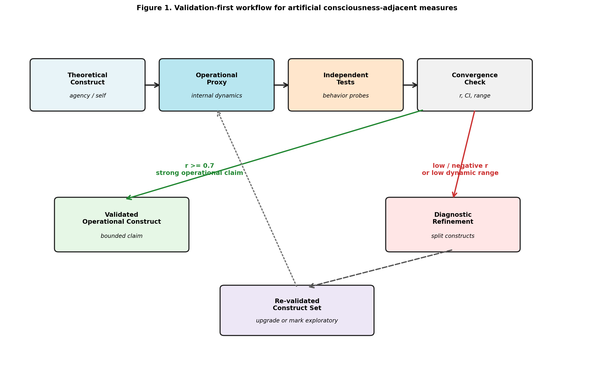
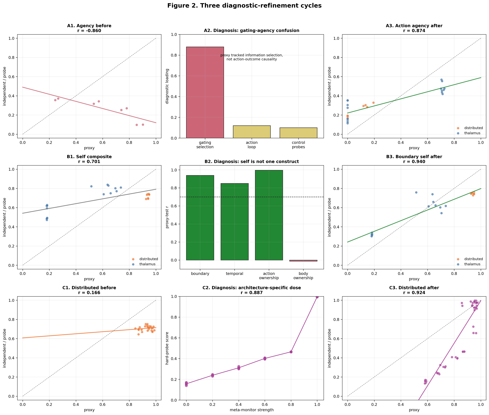
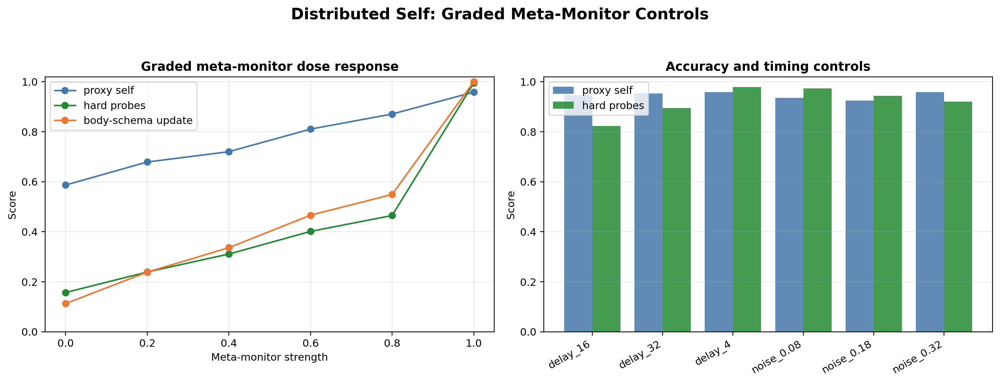
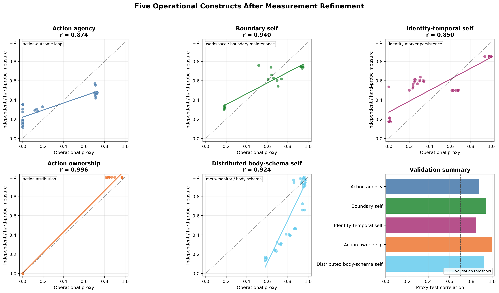
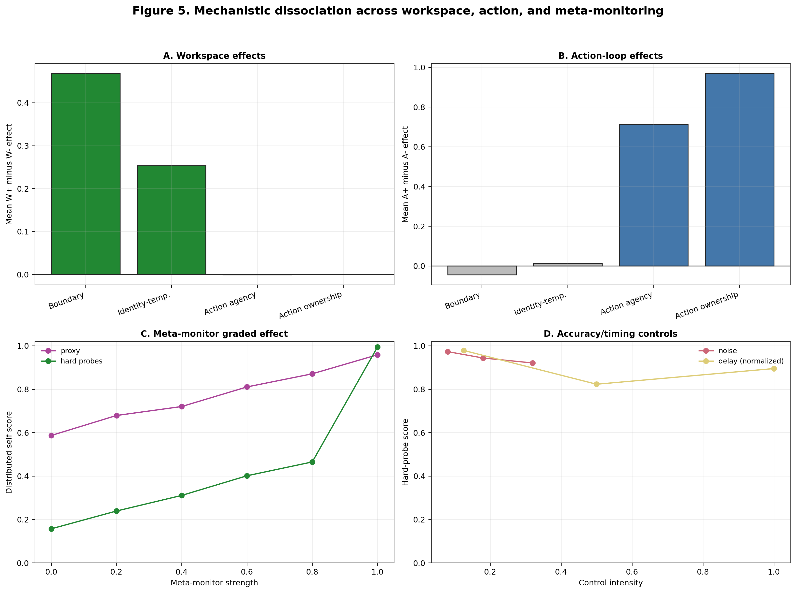
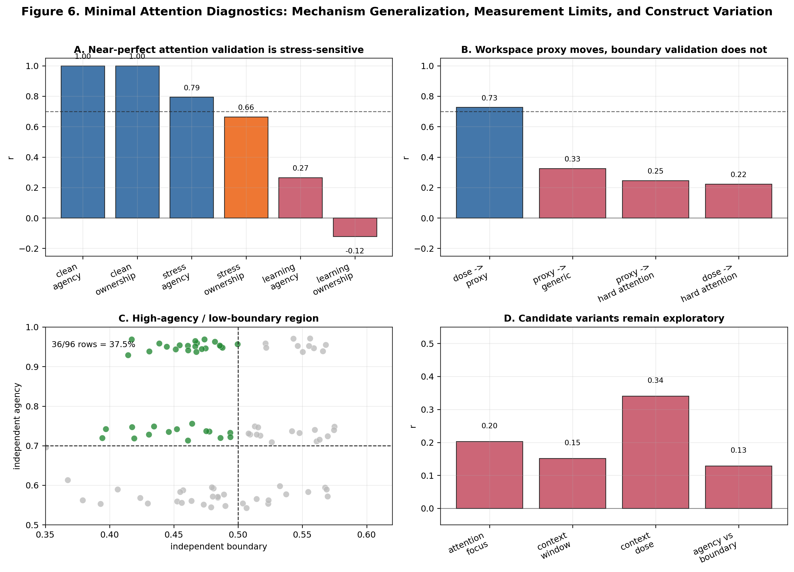

# Abstract

Operational proxies are common in artificial consciousness research, but their validity is rarely tested against independent behavioral measures. We evaluate such proxies in artificial neural architectures by comparing internal-state measures with behavior-level probes. Initial validation exposed substantial mismatches: a thalamus-inspired agency proxy was negatively correlated with independent agency tests (`r=-0.860`), and generic distributed self tests had poor convergence. Diagnostic experiments showed that the agency proxy primarily measured gating rather than action-outcome control, and that broad self-model scores conflated boundary maintenance, identity persistence, and ownership. After refinement, five operational constructs showed strong proxy-test convergence, including action agency (`r=0.874`) and boundary self (`r=0.940`). Mechanistic manipulations then separated their computational substrates: workspace mechanisms supported boundary and identity-temporal measures, action-outcome loops supported agency and action ownership, and meta-monitoring supported distributed body-schema measures. A subsequent minimal attention-based diagnostic showed that action-loop effects generalize to an attention-based substrate, while boundary-self validation remains measurement-limited. All architectures studied here are small custom simulations used as controlled measurement testbeds, not production-scale language models. The pattern argues that proxy validation should precede mechanistic interpretation, and that diagnostic failures of theoretically motivated proxies can themselves refine the construct set.

# 1. Introduction

Artificial consciousness research depends on operational measurement. Constructs such as global broadcasting, self-model stability, temporal continuity, ownership, and agency cannot be read directly from a system. They must be inferred from proxies. This is unavoidable, but it creates a risk: a proxy can be theoretically motivated and still measure the wrong process.

This risk is especially acute when constructs co-occur in biological systems. Information selection, action control, body ownership, temporal continuity, and boundary maintenance are deeply entangled in living agents. Artificial systems allow cleaner dissociation. A system can have information gating without action-outcome control, or distributed body-schema tracking without subjective ownership. This makes artificial architectures useful not because they are simpler, but because they allow interventions that are difficult or impossible in biological systems.

We studied this problem in three primary research contexts: a thalamus-inspired architecture with reticular gating and a limited workspace, a distributed multi-agent architecture with local agents and a meta-monitor, and an artificial-life quality-diversity archive used as open-ended search context. A subsequent minimal attention-based follow-up tested whether the main mechanism pattern survived in a Transformer-style substrate. These systems are deliberately small custom simulations, not production-scale neural networks or large language models. Early experiments suggested self-agency dissociations, but measurement validation revealed that some proxies were mislabeled. We therefore shifted from mechanism interpretation to measurement validation.

Our central claim is methodological: validation must precede mechanistic interpretation. After an iterative diagnostic-refinement process, we validated five operational constructs and identified several exploratory or measurement-limited constructs that should remain outside strong mechanism claims.

The paper makes three contributions. First, it shows that a theoretically motivated proxy can fail in a structured way: the original agency proxy was strongly anti-correlated with independent tests because it measured gating rather than action-outcome control. Second, it uses this failure to refine the construct set, separating action agency, boundary self, identity-temporal self, action ownership, and distributed body-schema self. Third, it links these validated constructs to separable computational substrates--workspace, action-outcome loops, and meta-monitoring--while using subsequent attention-based diagnostics to show that mechanism generalization and construct validation can diverge.

## 1.1 Related Work and Measurement Framing

The computational mechanisms studied here are motivated by several overlapping literatures, but the claims made in this paper are narrower than the theories that inspired them. Global workspace theories argue that conscious access depends on selective broadcast and integration across specialized processors (Baars, 1988; Dehaene and Changeux, 2011). Our workspace manipulations are related to that idea, but we treat them as operational integration mechanisms rather than as sufficient conditions for consciousness.

Predictive-processing and comparator accounts of agency emphasize action-outcome prediction, prediction error, and cue integration in the sense of control (Friston, 2010; Synofzik et al., 2008; Moore and Fletcher, 2012; Haggard et al., 2002). These theories motivate the action-loop manipulation and the decision to separate action agency from information gating.

Work on minimal selfhood and body ownership distinguishes bodily boundary, ownership, agency, and temporal continuity as partially separable phenomena (Gallagher, 2000; Blanke and Metzinger, 2009; Tsakiris, 2010; Seth, 2013). This motivates our decision to decompose self-model measures rather than treating selfhood as one score.

The measurement strategy comes from construct-validity research. Psychological measurement has long distinguished theoretical constructs from their indicators, and has emphasized convergent and discriminant validation across methods (Cronbach and Meehl, 1955; Campbell and Fiske, 1959; Borsboom et al., 2004). Artificial consciousness research often uses operational proxies, but proxy validity is rarely cross-validated against independent behavioral probes (Gamez, 2008; Reggia, 2013; Haladjian and Montemayor, 2016). This paper treats artificial architectures as measurement testbeds: if a proxy fails, the failure is informative because mechanisms can be cleanly separated and retested.

Recent AI-consciousness discussions make this measurement problem more urgent. Indicator-based assessments of AI consciousness emphasize that current systems should be evaluated against theory-derived properties rather than surface impressions alone (Butlin et al., 2023; Chalmers, 2023). Related work on AI welfare stresses uncertainty about consciousness and robust agency while warning against overconfident attribution (Long et al., 2024), and analyses of language-model consciousness highlight the risk of anthropomorphic interpretation in Transformer-based systems (Shardlow and Przybyla, 2024). Integrated Information Theory 4.0 offers a different formal route through intrinsic causal structure (Albantakis et al., 2023), which we do not attempt to compute here. The interpretability literature makes a parallel methodological point: technical labels can hide multiple concepts unless the target construct is made explicit (Lipton, 2018).

# 2. Methods

## 2.1 Architectures

### Thalamus-Inspired Architecture

The thalamus-inspired architecture contains sensory candidates, a reticular gating layer, a limited-capacity global workspace, cortical modules, and optional action-outcome loops. The workspace admits selected information items and broadcasts a compressed vector to cortical modules. The action loop predicts proprioceptive consequences of pending actions and updates prediction parameters from observed deltas.

The core factorial manipulation crosses workspace availability and action-loop availability:

- `W-A-`: no workspace, no action loop
- `W+A-`: workspace, no action loop
- `W-A+`: no workspace, action loop
- `W+A+`: workspace, action loop

### Distributed Multi-Agent Architecture

The distributed architecture contains local agents with limited perception, local memory, and local action requests. A coordination layer resolves conflicts. A meta-monitor tracks aggregate properties including active-agent count, centroid, spread, success, controllability, and goal alignment.

Distributed validation included feedback on/off, coordination on/off, agent-count changes, sensor-range changes, shifted goals, world-size changes, and graded meta-monitor controls.

### Artificial-Life Archive

The artificial-life path uses a quality-diversity archive over a four-dimensional behavior space. It is included as open-ended search context and future candidate-discovery infrastructure. It is not the primary source of the five validated constructs in this manuscript.

### Minimal Attention-Based Follow-Up

A subsequent minimal attention-based system was used for cross-architecture diagnosis. It is Transformer-style in the limited sense that it uses an attention block over synthetic tokens, but it is not a language model. It contains optional workspace-like memory and optional action-outcome loops. The purpose was not to model production language models or subjective report, but to test whether the same manipulations behave similarly in an attention-based substrate.

The attention-based follow-up crossed workspace availability with action-loop availability using the same notation as the thalamus factorial design:

- `W-A-`: no workspace memory, no action loop
- `W+A-`: workspace memory, no action loop
- `W-A+`: no workspace memory, action loop
- `W+A+`: workspace memory and action loop

Additional attention-substrate diagnostics varied action-effect noise, action-loop learning rate, and workspace strength. These diagnostics were treated as measurement probes rather than part of the primary validation set.

## 2.2 Initial Proxies

Initial evaluation tracked five proxy dimensions:

- state
- content
- self_model
- agency
- temporal_continuity

These dimensions were intentionally separated rather than collapsed into a single "consciousness score." However, validation showed that separation alone is insufficient. A separate proxy can still track the wrong construct.

## 2.3 Independent Tests

Independent tests were designed to avoid reusing the proxy column as the dependent variable. Agency-related tests included four behavior-level probes. The intentional-binding analogue measured whether systems compressed the interval between an initiated action and its predicted effect, following the logic of intentional binding tasks. The error-attribution test measured whether prediction errors were assigned to self-generated versus externally imposed actions. The controllability-preference test measured whether systems preferred environments in which their actions reliably changed outcomes. The forced-action probe measured whether agency scores dropped when actions were externally selected while observations remained available.

Self-related tests used perturbation and discrimination probes. Boundary perturbation measured recovery after perturbing self-marked versus non-self-marked state components. Self/other discrimination measured whether a system could distinguish its own state or action traces from matched traces generated by another system. The computational mirror test measured delayed or transformed self-recognition from previous behavior traces rather than from current internal state alone. Ownership attribution measured whether a system assigned observed outcomes to its own prior actions when competing external causes were present.

Measurement-strengthening tests were added after diagnosis. Delayed identity recognition tested whether an identity marker remained recognizable after intervening dynamics. Temporal-binding probes tested whether separated events could be ordered or bound into a coherent sequence. Forced-choice ownership presented one self-generated action and one externally generated action and scored selection accuracy. Ownership-illusion resistance measured whether a system rejected externally generated outcomes when they conflicted with its own action predictions. Distributed hard probes included meta-monitor lesion, hidden-agent perturbation, and body-schema update tests; graded meta-monitor strength, noise, and delay controls tested whether hard-probe scores tracked functional meta-monitor quality rather than module presence alone.

## 2.4 Refined Operational Constructs

All refined scores are normalized to `[0, 1]`, with larger values indicating stronger expression of the operational construct. A construct was treated as validated when its proxy and independent-test scores showed stable positive convergence, using `r >= 0.7` as the working threshold together with inspection of confidence intervals and condition-level behavior. Results in the intermediate range (`0.5 <= r < 0.7`) were treated as exploratory pending additional probes, while weaker or reversed relationships triggered diagnosis. The final five validated constructs are summarized below.

| Construct | Proxy score | Independent tests | Hypothesized mechanism |
|---|---|---|---|
| Action agency | action-outcome prediction/control score after separating gating from control | intentional-binding analogue, error attribution, controllability preference, forced-action probes | action-outcome loop |
| Boundary self | boundary-maintenance proxy derived from workspace-supported self-boundary stability | boundary perturbation and self/other discrimination probes | workspace |
| Identity-temporal self | identity-marker persistence proxy | delayed identity recognition and temporal-binding probes | workspace |
| Action ownership | action-attribution proxy | forced-choice ownership and ownership-illusion resistance probes | action-outcome loop |
| Distributed body-schema self | meta-monitor/body-schema coherence proxy | meta-monitor lesion, hidden-agent perturbation, body-schema update, and graded controls | meta-monitor |

These are operational constructs rather than reports of subjective experience. The proxy column and independent-test column are intentionally kept separate in the benchmark package so that future systems can reproduce the validation rather than inherit a pre-combined score. Hypothesized mechanisms are based on prior theory and architectural design; their effects are tested empirically in Section 3.6.

## 2.5 Diagnostic Protocol

When proxy-test convergence was below the validation threshold, we used a diagnostic-refinement cycle. Reversed relationships (`r < 0`) or weak convergence (`r < 0.5`) were treated as strong evidence of construct mismatch; intermediate results (`0.5 <= r < 0.7`) were retained as exploratory unless additional probes established stable convergence.

1. Inspect condition-level failures.
2. Measure intermediate variables.
3. Identify which variable the proxy actually tracks.
4. Split conflated constructs.
5. Re-validate each refined construct.
6. Upgrade claims only for constructs with stable convergence.

This procedure follows a multitrait-multimethod logic: a construct is strengthened when proxy and behavioral tests converge, but also when nearby constructs remain discriminable. Failure therefore triggers diagnosis rather than ad hoc relabeling.

Figure 1 summarizes this validation-diagnosis-refinement workflow.

{width=95%}

## 2.6 Claim Tiers

We use four claim tiers:

- Validated operational construct: strong proxy-test convergence.
- Validated construct after decomposition: strong convergence after a broader construct was split.
- Exploratory construct: interesting but weak or unstable convergence.
- Measurement-limited construct: current tests lack dynamic range or sensitivity.

Only validated constructs are used for strong mechanism claims.

Minimal attention-based follow-up analyses are explicitly assigned to the exploratory or measurement-limited tiers. They are used to test generalization and expose architecture-specific measurement failures, not to expand the primary validated construct set.

## 2.7 Statistical Analysis

Proxy-test convergence was quantified with Pearson correlation. Bootstrap 95% confidence intervals were computed from 10,000 paired resamples. Mechanistic effects in the thalamus-inspired factorial design are reported as condition mean differences: workspace effects are the average of `W+A- - W-A-` and `W+A+ - W-A+`; action-loop effects are the average of `W-A+ - W-A-` and `W+A+ - W+A-`. Confidence intervals for these effects were computed by resampling within each condition. Because some refined probes, especially action-ownership probes, are near-deterministic, standardized effect sizes can become very large and three-decimal confidence intervals can become very narrow. Mean differences and confidence intervals are therefore treated as the primary quantities, with Cohen's d retained as an auxiliary statistic and higher-precision bootstrap outputs reported in the machine-readable statistics. For correlations exceeding `0.99`, we report six-decimal precision to distinguish near-ceiling values; for near-zero mean differences, we report four-decimal precision to show the confidence interval. Mean differences smaller than the four-decimal display threshold are reported as `+0.0000` with their confidence intervals.

For distributed meta-monitor controls, we report Pearson correlations between graded control variables and hard-probe scores. Meta-monitor strength is expected to correlate positively with hard-probe scores; meta-monitor noise and delay are expected to correlate negatively if probes track functional degradation. Delay was retained as a control even though it did not show a strong monotonic relationship in the primary run.

Minimal attention-based follow-up analyses use the same correlation-based reporting but are not included in the primary validation tables. Their role is diagnostic: they test whether mechanism effects and measurement validity behave similarly in an attention-based substrate.

## 2.8 Data, Figures, and Reproducibility

The primary statistical pass was generated by `scripts/finalize_statistics.py` with 10,000 bootstrap resamples and seed `20260521`. Machine-readable outputs are stored in `docs/paper/statistics/final_20260521`, including:

- `final_statistics.json`
- `construct_validation_stats.csv`
- `mechanism_effects.csv`
- `distributed_control_correlations.csv`
- `number_consistency.csv`

The five main figures are generated by `scripts/generate_paper_figures_v2.py` and stored in `docs/paper/figures/paper_v2_20260521`. The minimal attention diagnostic figure is generated by `scripts/generate_transformer_figure6.py`. The current figure manifest is `docs/paper/figures/paper_v2_20260521/manifest.json`.

The public benchmark interface mirrors the same data structure. The `consciousness_benchmark` package exposes each construct as a pair of columns (`proxy_col`, `independent_col`) plus architecture metadata (`validated_in`, `measurement_limited_in`, and `variants`). This prevents a construct from being silently applied to an architecture where it is unvalidated or measurement-limited.

# 3. Results

## 3.1 Initial Validation Failures

The first validation pass showed that the original thalamus agency proxy was anti-correlated with independent agency tests (`r=-0.860`). Inspection showed the most problematic case was `W-A-`: a system with no action loop could receive a high agency proxy score because the proxy was actually tracking gating activity.

Self-model validation was mixed. The initial self-model proxy showed moderate overall agreement, but the result concealed construct mismatch. Distributed self validation was especially weak under the original generic tests (`r=0.166`), suggesting either absence of the construct or inadequate measurement sensitivity.

These failures were treated as measurement evidence. If a theoretically motivated proxy reverses against independent tests, then either the tests are inappropriate, the proxy is mislabeled, or the construct is underspecified.

The three diagnostic-refinement cycles are summarized in Figure 2.

{width=95%}

## 3.2 Agency Refinement

The original agency proxy conflated information selection with behavioral control. We split it into:

- `gating_coordination_proxy`: information selection and gating
- `action_agency_proxy`: action-outcome prediction and control
- `legacy_agency_proxy`: retained for auditability

After correction, action-agency proxy-test convergence improved from negative correlation in thalamus systems to strong positive convergence overall:

- action agency: `r=0.874`, 95% CI `[0.774, 0.943]`, `p=2.4e-08`

This preserved the mechanism finding while changing its interpretation: action-outcome loops increased operational agency, whereas workspace alone did not. The original high scores in no-action-loop thalamus systems were therefore not evidence for agency; they were evidence that information gating had been misclassified as agency.

## 3.3 Self-Model Decomposition

The initial self-model proxy mixed multiple operational constructs. Boundary/core self validated strongly:

- boundary self: `r=0.940`, 95% CI `[0.847, 0.994]`, `p<1e-9`

Temporal self required further splitting. Generic trajectory consistency did not align with refined temporal tests. The validated temporal component was identity persistence:

- identity marker persistence vs delayed identity recognition: `r=0.850`, 95% CI `[0.755, 0.912]`, `p<1e-9`

Ownership also required splitting. Body ownership remained exploratory, but action ownership validated strongly:

- action ownership: `r=0.996`, 95% CI `[0.994, 0.998]`, `p<1e-9`

Boundary self, identity-temporal self, action ownership, and body ownership are operationally separable. Only the first three refined self-related constructs above were upgraded into strong claims. Body ownership is not reported as a validated row because the available proxy-test pairing did not meet the `r >= 0.7` criterion in the frozen Paper 1 analysis; stronger multisensory integration probes are left for future work.

## 3.4 Distributed Self Probes

Generic distributed self tests initially had poor dynamic range. We therefore added architecture-specific probes:

- meta-monitor lesion
- hidden-agent perturbation
- body-schema update

With these probes, distributed body-schema/meta-monitor self validated strongly:

- distributed body-schema self: `r=0.924`, 95% CI `[0.881, 0.956]`, `p<1e-9`

To rule out the explanation that hard probes merely detected a binary meta-monitor switch, we introduced graded meta-monitor controls. Hard-probe scores varied continuously with meta-monitor strength:

- meta-monitor strength vs hard probes: `r=0.887`, 95% CI `[0.846, 0.945]`, `p=7.9e-09`

Meta-monitor noise strongly degraded hard-probe scores:

- meta-monitor noise vs hard probes: `r=-0.974`, 95% CI `[-0.992, -0.952]`, `p=9.0e-08`

This supports the interpretation that hard probes track functional meta-monitor quality, not merely module presence (Figure 3).

{width=95%}

## 3.5 Validated Operational Constructs

Table 1 summarizes the final validated construct set:

**Table 1. Validated operational constructs and associated mechanisms.**

| Construct | n | Proxy-test r (95% CI) | p | Status | Mechanism |
|---|---:|---:|---:|---|---|
| Action agency | 24 | 0.874 [0.774, 0.943] | 2.4e-08 | validated | action-outcome loop |
| Boundary self | 24 | 0.940 [0.847, 0.994] | <1e-9 | validated | workspace |
| Identity-temporal self | 48 | 0.850 [0.755, 0.912] | <1e-9 | validated | workspace |
| Action ownership | 48 | 0.996 [0.994, 0.998] | <1e-9 | validated | action-outcome loop |
| Distributed body-schema self | 52 | 0.924 [0.881, 0.956] | <1e-9 | validated | meta-monitor |

\clearpage

These correlations are visualized in Figure 4.

{width=95%}

Sample sizes differ because the first two constructs use the thalamus factorial validation set, identity-temporal self and action ownership include the refined extension probes, and distributed body-schema self includes architecture-specific hard probes plus graded meta-monitor controls. For the distributed architecture, graded controls served as the analogue of the factorial mechanism check because the architecture was not organized around the same workspace-by-action-loop design.

Extended 16-seed robustness analyses are reported in Supplementary Section S1. In that extension, all five constructs remained above the validation threshold, but estimates were generally lower; action agency decreased from `r=0.874` in the frozen primary table to `r=0.727` in the 16-seed pooled run. The primary values should therefore be read as frozen estimates from the prerelease analysis pass, not as final population estimates.

The near-ceiling action-ownership convergence is interpreted with care in Section 4.5: under the low-noise primary conditions, proxy and independent tests share substantial task variance, so the magnitude should be read as a stable measurement coupling rather than as independent statistical strength.

## 3.6 Mechanistic Dissociation

Mechanistic analysis showed a clear dissociation:

- Workspace availability strongly affected boundary self (`+0.4679`, 95% CI `[0.4347, 0.4963]`) and identity-temporal self (`+0.2535`, 95% CI `[0.2113, 0.2859]`), while having negligible effect on action agency (`-0.0011`, 95% CI `[-0.0062, 0.0049]`) and action ownership (`+0.0001`, 95% CI `[-0.0002, 0.0004]`).
- Action-loop availability strongly affected action agency (`+0.7113`, 95% CI `[0.7064, 0.7173]`) and action ownership (`+0.9680`, 95% CI `[0.9678, 0.9683]`), while having only a small effect on boundary self (`-0.0453`, 95% CI `[-0.0781, -0.0157]`) and little effect on identity-temporal self (`+0.0131`, 95% CI `[-0.0201, 0.0546]`).
- Meta-monitor strength showed a graded relationship with distributed hard-probe scores (`r=0.887`, 95% CI `[0.846, 0.945]`), and meta-monitor noise degraded them (`r=-0.974`, 95% CI `[-0.992, -0.952]`).

This supports an operational triple dissociation among workspace, action-outcome, and meta-monitoring mechanisms (Figure 5).

{width=95%}

## 3.7 Minimal Attention-Based Follow-Up

The minimal attention-based follow-up tested whether the mechanism pattern generalized to a Transformer-style but non-language-model substrate. The initial 2x2 run showed selective mechanism effects while also exposing architecture-specific measurement limits (Figure 6).

{width=95%}

Action-loop availability increased the action-agency proxy (`+0.8189`, 95% CI `[0.8180, 0.8198]`, `p<1e-9`) and the action-ownership proxy (`+0.8189`, 95% CI `[0.8180, 0.8198]`, `p<1e-9`). It had little effect on the boundary-self proxy (`-0.0046`, 95% CI `[-0.3087, 0.2585]`, `p=0.9760`). Workspace availability increased the boundary-self proxy (`+0.8296`, 95% CI `[0.8207, 0.8377]`, `p<1e-9`) but not the action-agency proxy (`+0.0000`, 95% CI `[-0.3066, 0.2564]`, `p=1.0000`).

The low-noise 2x2 run also produced near-ceiling proxy-test correlations for action agency (`n=32`, `r=0.999825`, 95% CI `[0.999677, 0.999947]`) and action ownership (`n=32`, `r=0.999995`, 95% CI `[0.999990, 0.999999]`). Difficulty diagnostics reduced these values when action-effect noise and action-loop learning rate were varied, with pooled convergence dropping to `r=0.795` for agency and `r=0.664` for ownership. This indicates that the near-ceiling correlations reflected shared variance from action-outcome prediction accuracy under low-noise conditions. The mechanism effect remains meaningful, but the low-noise validation statistic should not be interpreted as independent construct validation.

Boundary self showed the opposite pattern. Workspace dose tracked the internal boundary proxy (`n=40`, `r=0.728`, 95% CI `[0.564, 0.845]`), but it did not converge with generic boundary probes (`r=0.325`) or attention-specific hard boundary probes (`r=0.246`). This result therefore supports a conservative interpretation: action-loop mechanisms generalize well to an attention-based substrate, but boundary self remains measurement-limited in the current minimal attention implementation. Workspace memory changes internal state, yet those changes do not currently translate into behaviorally or attentionally validated boundary maintenance.

Exploratory construct-variant tests also remained outside the validated set. Attention-focus self (`r=0.203`) and context-window self (`r=0.152`) did not validate as attention-specific alternatives. A high-agency / low-boundary profile appeared in `36/96` rows (`37.5%`), with independent agency and boundary scores largely dissociated (`r=0.129`). This profile is best treated as an architecture-conditioned diagnostic pattern, not as a new validated self construct.

Extended minimal attention validation, workspace capacity sweeps, and detailed attention-substrate diagnostic tables are reported in Supplementary Sections S2-S4.

# 4. Discussion

## 4.1 Proxy Failure Can Be Productive

The initial agency failure was not merely a bug. It exposed a conceptual confusion. In biological systems, gating and action control often co-occur. In artificial systems, they can be separated. This separation revealed that the original proxy measured information selection rather than agency.

A failed validation can be informative when it reveals which construct a proxy actually measures. The thalamus `W-A-` case made this especially clear: a no-action-loop system looked agentic under the original proxy because it gated information strongly, but independent agency probes remained low. The corrected proxy was applied to the same data, and the mechanism direction did not change.

## 4.2 Self-Model Is Not a Single Operational Kind

Boundary maintenance, identity persistence, action ownership, and body ownership are not interchangeable. Treating them as one score hides both successes and failures.

This decomposition also changes the interpretation of mechanism effects. Workspace mechanisms supported boundary and identity-temporal measures, but they did not automatically support action ownership. Action loops supported agency and action ownership, but they did not automatically support boundary self. A single "self-model score" would obscure this pattern and invite overclaiming.

## 4.3 Architecture-Specific Measurement Is Necessary

The distributed architecture initially appeared measurement-limited. Hard probes with graded meta-monitor controls revealed that the problem was not necessarily absence of a distributed self-like process, but mismatch between generic tests and architecture-specific organization.

The minimal attention follow-up adds the complementary lesson. Architecture-specific testing did not rescue boundary self. Instead, it showed that the internal workspace proxy could respond strongly to workspace dose while failing independent boundary probes. This suggests that some constructs may require architectural prerequisites. An attention-based substrate can express action-outcome agency and ownership-like operational signals when action loops are added, but it may not implement the kind of boundary-maintenance behavior measured in thalamus-inspired or embodied systems.

## 4.4 Architecture-Conditioned Construct Variations

The attention-substrate mini-study suggests that construct discovery should be architecture-conditioned rather than universal by default. Two intuitive candidates failed: attention-focus self did not validate (`r=0.203`), and context-window self did not validate (`r=0.152`) despite a weak dose signal. These negative results are useful because they show that architectural vocabulary cannot simply be relabeled as selfhood. Attention is not automatically self, and context retention is not automatically temporal identity.

The strongest attention-substrate pattern was instead a dissociation profile: predictive agency without validated boundary self. In the agency-boundary grid, `37.5%` of rows showed high independent agency and low independent boundary score, while independent agency and boundary scores were nearly unrelated (`r=0.129`). This profile is not a phenomenological claim that a model "has agency without a self." The safer interpretation is measurement-level: action-outcome prediction can be strong in an attention-based substrate even when boundary-maintenance probes fail.

This should also not be read as evidence that attention-based systems lack all possible self-related constructs. The present tests address boundary self as operationalized here. Other self-like constructs may require different tasks, longer temporal structure, or different architectural probes. Comparisons to human flow states, automatic action, or meditative reports are therefore heuristic analogies rather than evidence.

This matters theoretically because it extends the original dissociation. The main experiments showed that workspace-like, action-loop, and meta-monitor mechanisms can be separately manipulated. The attention-substrate profile suggests a further possibility: some architectures may naturally occupy regions of construct space where one measured component is strong and another is absent or unmeasurable. The construct space therefore needs to be conditioned on architecture, with explicit records of where validation succeeded, where measurement was limited, and where architecture-specific variants emerged.

## 4.5 Mechanistic Claims Must Follow Validation

The corrected data support operational mechanism claims: workspace mechanisms support boundary and identity-temporal self measures, action-outcome loops support agency and action ownership measures, and meta-monitoring supports distributed body-schema self measures. They do not establish subjective consciousness, subjective selfhood, or phenomenological agency.

Very high convergence should also be interpreted carefully. The primary action-ownership result (`r=0.996`) supports a stable operational relation between attribution proxy and ownership tests, but its near-deterministic range also limits the evidential value of the numerical magnitude. In this case, the relevant claim is not that action ownership is "perfectly" validated; it is that action-attribution and forced-choice/illusion-resistance probes move together under the action-loop manipulation. The minimal attention stress tests make the same caution explicit: near-ceiling correlations can reflect shared task variance under clean conditions. Over-convergence is therefore a measurement warning sign as well as a sign of reliability.

This distinction is important for computational models of consciousness-related constructs. The validated constructs are suitable for comparing architectures, diagnosing measurement failures, and testing mechanism sensitivity. They are not sufficient for attributing experience. The correct claim is that some systems satisfy validated operational criteria for action agency, boundary maintenance, identity persistence, action ownership, or distributed body-schema tracking.

## 4.6 Limitations and Future Work

The main limitation is conceptual: proxy-test convergence is not evidence of subjective experience. The constructs reported here are operational measures suitable for comparing systems and testing mechanism sensitivity, but they do not establish phenomenological selfhood, agency, or consciousness. The independent tests are also theory-laden. They provide a stronger measurement basis than internal proxies alone, but they may still miss aspects of the target constructs.

A second limitation is scope. Body ownership and trajectory consistency remain exploratory: body ownership lacked convergent proxy-test evidence, and trajectory consistency did not align with the validated identity-temporal construct. Attention-based boundary self also remains measurement-limited: workspace manipulations affect an internal boundary proxy, but not the current behavior-level or attention-boundary probes. The high-agency / low-boundary attention-substrate profile is therefore best treated as an architecture-conditioned diagnostic pattern, not as a new validated construct. The minimal attention analyses were conducted as a post-hoc generalization test rather than as part of the primary analyses and should be evaluated separately.

Future work should focus on two directions. One is measurement expansion: stronger multisensory tests for body ownership, separate treatment of trajectory consistency, and biological or phenomenological cross-validation of the validated constructs. The other is architectural generalization: testing whether high-agency / low-boundary profiles persist in larger attention-based systems and using the artificial-life archive to search for naturally emerging dissociations. The benchmark package now includes architecture metadata for constructs; extending this metadata as new systems are tested is a practical route toward an architecture-conditioned construct library.

# 5. Conclusion

This work shows that operational proxies in computational models of consciousness-related constructs can fail systematically, even when theoretically motivated. Treating failure diagnostically allowed us to refine constructs, validate five measures, and identify dissociable computational substrates. Workspace, action-outcome, and meta-monitoring mechanisms supported different validated constructs, while minimal attention follow-ups showed that mechanism generalization and construct validation can diverge. The broader lesson is methodological: measurement validation is not a post-hoc check; it is a prerequisite for mechanistic interpretation.

# References

Albantakis, L., Barbosa, L., Findlay, G., Grasso, M., Haun, A. M., Marshall, W., Mayner, W. G. P., Zaeemzadeh, A., Boly, M., Juel, B. E., Sasai, S., Fujii, K., David, I., Hendren, J., Lang, J. P., & Tononi, G. (2023). Integrated Information Theory (IIT) 4.0: Formulating the properties of phenomenal existence in physical terms. *PLOS Computational Biology*, 19(10), e1011465.

Baars, B. J. (1988). *A cognitive theory of consciousness*. Cambridge University Press.

Blanke, O., & Metzinger, T. (2009). Full-body illusions and minimal phenomenal selfhood. *Trends in Cognitive Sciences*, 13(1), 7-13.

Borsboom, D., Mellenbergh, G. J., & van Heerden, J. (2004). The concept of validity. *Psychological Review*, 111(4), 1061-1071.

Butlin, P., Long, R., Elmoznino, E., Bengio, Y., Birch, J., Constant, A., Deane, G., Fleming, S. M., Frith, C., Ji, X., Kanai, R., Klein, C., Lindsay, G., Michel, M., Mudrik, L., Peters, M. A. K., Schwitzgebel, E., Simon, J., & VanRullen, R. (2023). Consciousness in artificial intelligence: Insights from the science of consciousness. *arXiv:2308.08708*.

Campbell, D. T., & Fiske, D. W. (1959). Convergent and discriminant validation by the multitrait-multimethod matrix. *Psychological Bulletin*, 56(2), 81-105.

Chalmers, D. J. (2023). Could a large language model be conscious? *Boston Review*.

Cronbach, L. J., & Meehl, P. E. (1955). Construct validity in psychological tests. *Psychological Bulletin*, 52(4), 281-302.

Dehaene, S., & Changeux, J.-P. (2011). Experimental and theoretical approaches to conscious processing. *Neuron*, 70(2), 200-227.

Friston, K. (2010). The free-energy principle: a unified brain theory? *Nature Reviews Neuroscience*, 11(2), 127-138.

Gallagher, S. (2000). Philosophical conceptions of the self: implications for cognitive science. *Trends in Cognitive Sciences*, 4(1), 14-21.

Gamez, D. (2008). Progress in machine consciousness. *Consciousness and Cognition*, 17(3), 887-910.

Haladjian, H. H., & Montemayor, C. (2016). Artificial consciousness and the consciousness-attention dissociation. *Consciousness and Cognition*, 45, 210-225.

Haggard, P., Clark, S., & Kalogeras, J. (2002). Voluntary action and conscious awareness. *Nature Neuroscience*, 5(4), 382-385.

Lipton, Z. C. (2018). The mythos of model interpretability. *Communications of the ACM*, 61(10), 36-43.

Long, R., Sebo, J., Butlin, P., Finlinson, K., Fish, K., Harding, J., Pfau, J., Sims, T., Birch, J., & Chalmers, D. (2024). Taking AI welfare seriously. *arXiv:2411.00986*.

Moore, J. W., & Fletcher, P. C. (2012). Sense of agency in health and disease: a review of cue integration approaches. *Consciousness and Cognition*, 21(1), 59-68.

Reggia, J. A. (2013). The rise of machine consciousness: Studying consciousness with computational models. *Neural Networks*, 44, 112-131.

Seth, A. K. (2013). Interoceptive inference, emotion, and the embodied self. *Trends in Cognitive Sciences*, 17(11), 565-573.

Shardlow, M., & Przybyla, P. (2024). Deanthropomorphising NLP: Can a language model be conscious? *PLOS ONE*, 19(12), e0307521.

Synofzik, M., Vosgerau, G., & Newen, A. (2008). Beyond the comparator model: a multifactorial two-step account of agency. *Consciousness and Cognition*, 17(1), 219-239.

Tsakiris, M. (2010). My body in the brain: a neurocognitive model of body-ownership. *Neuropsychologia*, 48(3), 703-712.
