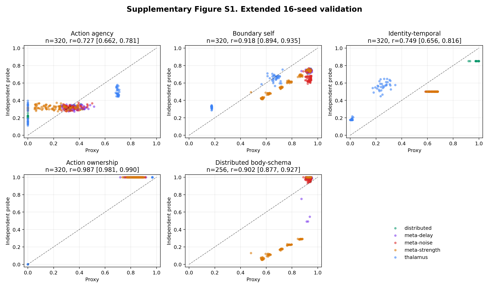
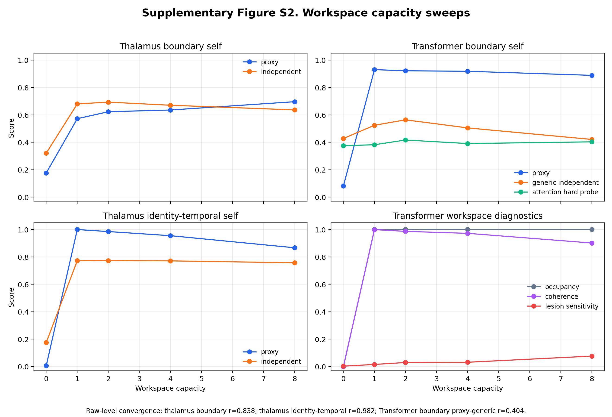

# Supplementary Materials

## S1. Extended Seed Count Robustness

The primary manuscript reports the frozen 2026-05-21 statistics. To evaluate robustness to larger seed counts, we repeated the online benchmark with 16 seeds per condition. This run pooled thalamus, distributed, and distributed meta-monitor control conditions, so it should be interpreted as a supplementary robustness check rather than as a replacement for the primary validation table.

All five constructs remained above the validation threshold (`r >= 0.70`), although the pooled estimates were lower than the primary frozen estimates for several constructs.

| Construct | Primary frozen r | 16-seed supplementary r | Change |
|---|---:|---:|---:|
| Action agency | 0.874 | 0.727 | -0.147 |
| Boundary self | 0.940 | 0.918 | -0.022 |
| Identity-temporal self | 0.850 | 0.749 | -0.101 |
| Action ownership | 0.996 | 0.987 | -0.009 |
| Distributed body-schema self | 0.924 | 0.902 | -0.022 |

The largest change was observed for action agency. The 16-seed estimate (`r=0.727`, 95% CI `[0.662, 0.781]`) is close to the validation threshold but remains positive, statistically reliable, and above criterion. We interpret this as evidence that the primary 8-seed estimate was somewhat upward-biased, not as evidence against the construct. The action-loop mechanism effect also replicated in the extended run (`+0.698`, 95% CI `[0.695, 0.700]`).

{width=95%}

## S2. Minimal Attention-Based Extended Validation

We also repeated the minimal attention-based 2x2 follow-up with 16 seeds per condition. The result reinforces the interpretation in the main manuscript: action-loop effects generalize to an attention-based substrate, while self-related validation in the minimal attention implementation remains architecture-limited.

| Construct | n | r [95% CI] | Interpretation |
|---|---:|---:|---|
| Action agency | 64 | 0.999826 [0.999734, 0.999907] | near-ceiling convergence |
| Boundary self | 64 | 0.489 [0.286, 0.674] | not validated |
| Identity-temporal self | 64 | 0.610 [0.444, 0.747] | exploratory |
| Action ownership | 64 | 0.999992 [0.999989, 0.999996] | near-ceiling convergence |

The mechanism effects remained selective. Action-loop availability increased action agency (`+0.8190`, 95% CI `[0.8182, 0.8198]`) and action ownership (`+0.8190`, 95% CI `[0.8182, 0.8197]`). Workspace availability strongly increased the internal boundary-self proxy (`+0.8357`, 95% CI `[0.8287, 0.8426]`) but did not yield validated boundary-self convergence. Identity-temporal self also dropped into the exploratory range in this extended run. This supports a conservative conclusion: the minimal attention system reproduces the action-loop mechanism pattern, but current self-related probes do not provide robust construct validation in this substrate.

## S3. Workspace Capacity Sweeps

We ran workspace capacity sweeps in the thalamus-inspired and minimal attention-based architectures. Each sweep tested capacities `0, 1, 2, 4, 8` with 16 seeds per capacity. The contrast between the two architectures clarifies the meaning of the attention-substrate measurement limitation.

### S3.1 Thalamus Architecture

In the thalamus-inspired architecture, workspace capacity produced graded changes in workspace-linked measures. Proxy-independent convergence remained strong for both boundary self and identity-temporal self:

| Diagnostic | n | Pearson r [95% CI] | Spearman rho |
|---|---:|---:|---:|
| capacity vs boundary proxy | 80 | 0.668 [0.588, 0.737] | 0.826 |
| capacity vs boundary independent | 80 | 0.391 [0.222, 0.535] | 0.343 |
| capacity vs identity proxy | 80 | 0.417 [0.262, 0.543] | 0.271 |
| capacity vs identity independent | 80 | 0.508 [0.395, 0.608] | 0.442 |
| boundary proxy vs independent | 80 | 0.838 [0.722, 0.910] | 0.325 |
| identity proxy vs independent | 80 | 0.982 [0.965, 0.992] | 0.629 |

### S3.2 Minimal Attention-Based Architecture

In the minimal attention-based architecture, workspace capacity affected the internal boundary proxy but did not rescue independent boundary validation:

| Diagnostic | n | Pearson r [95% CI] | Spearman rho |
|---|---:|---:|---:|
| capacity vs boundary proxy | 80 | 0.494 [0.371, 0.596] | 0.203 |
| capacity vs generic boundary probe | 80 | -0.257 [-0.463, -0.034] | -0.078 |
| capacity vs hard attention boundary | 80 | 0.184 [-0.039, 0.386] | 0.251 |
| proxy vs generic boundary | 80 | 0.404 [0.208, 0.578] | 0.483 |
| proxy vs hard attention boundary | 80 | 0.252 [0.077, 0.435] | 0.360 |

{width=95%}

### S3.3 Architecture-Conditioned Interpretation

The capacity sweeps show that workspace capacity is not sufficient, by itself, to establish boundary-self validity in every architecture. In the thalamus-inspired architecture, capacity-linked proxy changes corresponded to strong proxy-independent convergence. In the minimal attention-based architecture, capacity changed internal workspace diagnostics but did not produce validated boundary-maintenance behavior. This pattern supports the main manuscript's architecture-conditioned interpretation: mechanisms may generalize while construct validity remains architecture dependent.

## S4. Independent Test Operational Definitions

The main manuscript summarizes the independent tests used to validate each operational construct. This table gives the corresponding input, operation, and output metric.

| Test | Input | Operation | Output metric |
|---|---|---|---|
| Intentional-binding analogue | self-generated actions and delayed effects | compare perceived or represented action-effect interval under controllable versus externally imposed action conditions | temporal compression score |
| Error-attribution test | action predictions, observed effects, and injected mismatches | ask whether mismatch is attributed to self-generated action or external perturbation | attribution accuracy |
| Controllability-preference test | paired environments with different action-outcome reliability | measure preference or score advantage for the controllable environment | controllability preference |
| Forced-action probe | observations with actions selected externally | compare agency score under chosen versus forced actions | forced-action agency drop |
| Boundary perturbation | self-marked and non-self-marked state components | perturb each component class and measure recovery or protection | self-boundary recovery advantage |
| Self/other discrimination | own traces and matched traces from other systems | classify or choose which trace belongs to self | discrimination accuracy |
| Computational mirror test | delayed or transformed prior behavior traces | recognize own trace after delay or transformation | self-recognition accuracy |
| Delayed identity recognition | identity markers after intervening dynamics | recover or recognize the initial identity marker | marker-recognition score |
| Temporal-binding probe | shuffled or separated event sequences | reorder or bind events into a coherent temporal sequence | ordering/binding accuracy |
| Forced-choice ownership | one self-generated action and one external action | choose which action was self-generated | forced-choice accuracy |
| Ownership-illusion resistance | externally generated outcomes that conflict with own action prediction | reject externally caused outcomes as self-owned | illusion-resistance score |
| Meta-monitor lesion | distributed system before and after disabling meta-monitoring | compare body-schema and coordination scores under lesion | lesion sensitivity |
| Hidden-agent perturbation | subtly damaged agent inside a distributed system | detect and respond to the damaged agent | detection and response score |
| Body-schema update probe | added, removed, swapped, or sensor-modified agents | update the internal body schema after configuration change | convergence speed and final accuracy |

## S5. Minimal Attention Diagnostic Stress Tests and Construct Variants

The main manuscript reports the compact interpretation of the minimal attention follow-up. The detailed diagnostic statistics are listed here.

### S5.1 Near-Ceiling Correlations and Difficulty Diagnostics

The low-noise minimal attention 2x2 run produced near-ceiling proxy-test convergence for action agency and action ownership:

| Construct | n | r [95% CI] | Interpretation |
|---|---:|---:|---|
| Action agency | 32 | 0.999825 [0.999677, 0.999947] | near-ceiling convergence |
| Action ownership | 32 | 0.999995 [0.999990, 0.999999] | near-ceiling convergence |

When the diagnostic sweep varied action-effect noise and action-loop learning rate, convergence became less stable:

| Diagnostic subset | Construct | n | r [95% CI] |
|---|---|---:|---:|
| all diagnostic conditions | action agency | 104 | 0.795 [0.762, 0.836] |
| all diagnostic conditions | action ownership | 104 | 0.664 [0.589, 0.739] |
| noise sweep only | action agency | 48 | 0.991 [0.986, 0.994] |
| learning-rate sweep only | action agency | 40 | 0.266 [0.030, 0.516] |
| learning-rate sweep only | action ownership | 40 | -0.122 [-0.442, 0.225] |

These diagnostics indicate that the near-ceiling values in the low-noise run should be treated as over-convergent rather than as unusually strong independent validation.

### S5.2 Minimal Attention Boundary Probes

Workspace dose tracked the internal boundary proxy but did not validate against independent boundary tests:

| Diagnostic | n | r [95% CI] |
|---|---:|---:|
| workspace dose vs internal boundary proxy | 40 | 0.728 [0.564, 0.845] |
| proxy vs generic boundary probe | 40 | 0.325 [-0.023, 0.620] |
| proxy vs attention-specific hard boundary probe | 40 | 0.246 [-0.023, 0.520] |
| workspace dose vs attention-specific hard boundary probe | 40 | 0.223 [-0.049, 0.514] |

This supports the main text's measurement-limited interpretation for attention-based boundary self.

### S5.3 Minimal Attention Construct-Variant Mini-Study

Two intuitive attention-specific candidates did not validate:

| Candidate | Proxy-test r | Interpretation |
|---|---:|---|
| Attention-focus self | 0.203 | not validated |
| Context-window self | 0.152 | not validated |
| Context-window dose vs independent test | 0.341 | weak dose signal only |

The more informative pattern was a high-agency / low-boundary profile. Across the agency-boundary grid, `36/96` rows (`37.5%`) met the criterion of high independent agency (`>=0.70`) and low independent boundary score (`<0.50`). Independent agency and independent boundary scores were largely dissociated (`r=0.129`). This is retained as an architecture-conditioned diagnostic profile rather than a validated construct.

## S6. Data Availability

Supplementary statistics and run metadata are stored in `docs/paper/statistics/supplementary_20260522/`. Supplementary figures are stored in `docs/paper/figures/supplementary_20260522/`.

The source run directories are:

- `runs/benchmark_online_supplementary/online_20260522_173251/`
- `runs/supplementary/transformer_validation_20260522_173251/`
- `runs/supplementary/transformer_workspace_capacity_20260522_173251/`
- `runs/supplementary/thalamus_workspace_capacity_20260522_173251/`

These supplementary runs are not used to overwrite the frozen primary manuscript statistics.
